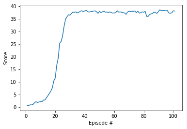

# Continuous Control

## Introduction

This report describes the neural network architecture used to solve the Continuous Control problem,
the hyperparammeters used to train the networks and the training results obtained.

## Learning Algoithm

The learning algorithm used to solve the task was **** Deep Deterministic Policy Gradient (DDPG) ****.  
This is an actor-critic algorithm that uses two neural networks, one for the actor and a second one for the critic.

The current state of the virtual robot arm is used as the input of the actor network and the output is a single value representing
the action (the policy). The critic network estimates the Q-value of the current state and the action output by the actor.

The network weights are updated from the gradients obtained from the temporal difference error signal.
To ensure good exploration, DDPG uses a stochastic policy using an Ornstein-Uhlenbeck process for the actor.
A deterministic policy is used for the critic.

The example DDPG code provided by Udacity and using PyTorch was adapted for the 20 agent environment.

### OU-Noise Decay

A decay Factor to decrease the amplitude of the OU-Noise over the time steps was implemeneted. The
effect of this is to make the agent explore less in later time steps as the training score (hopefully!)
increases and gets closer to the target.

## Neural Network Architecture

### Actor
  
- Hidden Layer 1 : 256 units using relu activation function
- Hidden Layer 2 : 128 units using relu activation function
- Output Layer   : 1 unit using tanh activation function
  
### Critic

- Hidden Layer 1 : 256 units using relu activation function
- Concat Layer   : 256 + size of actionspace (4)
- Hidden Layer 2 : 128 units using relu activation function
- Output Layer   : 1 unit using tanh activation function
  
## Hyperparameters

After some experimenting, the Hyperparameters were chosen as in the table below:

Parameter            |   Value
---------            |   -----
Replay Buffer Size   |   1e5
Minibatch Size       |   128
Discount Factor      |   0.99  
Tau (soft update)    |   1e-3
Learning Rate Actor  |   1e-4
Learning Rate Critic |   1e-4
L2 Weight Decay      |   0
Initial Epsilon      |   1.0
Minium Epsilon       |   0.01
Epsilon Decay        |   1e-6

The Ornstein-Uhlenbeck noise parameters (theta 0.15 and sigma 0.2) were left the same as in the DDPG Pendulum implementation.

## Results

The environment was solved (training score greater than or equal to 30 for 100 episodes) in 101 episodes.
A graph of the rewards obtained during the training episodes is shown below:

## Ideas For Future Work

For future work the following could be investigated:

- Implement Prioritized Experience Replay from the DQN paper, which may further reduce training time.
- Implement other algorithms like PPO, A3C or D4PG.